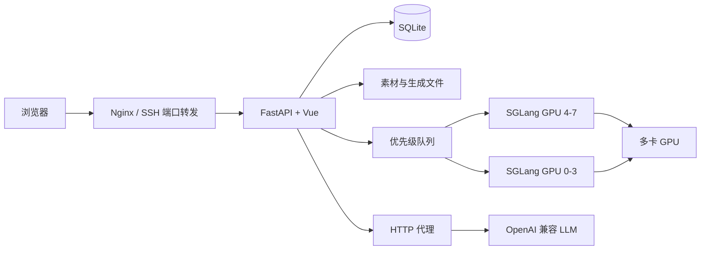

# MiniMax H3 WebUI

一个面向 MiniMax-H3 Ref2VA 的多用户视频生成工作台。项目使用 Vue 3 构建前端、FastAPI 提供后端服务，并通过 SQLite 管理用户、素材、任务队列和生成结果。

它适合在单台多卡 GPU 服务器上部署：SGLang 负责 MiniMax-H3 推理，WebUI 负责素材管理、提示词编辑、优先级排队、任务追踪和结果分享。

## 主要功能

- 图片、视频和音频参考素材上传与永久素材库
- 最多 9 张参考图片、3 段视频和 3 段音频
- 输入 `@` 智能补全 `@图1`、`@视频1`、`@音频1`
- 引用素材以 Tag 形式高亮，支持键盘选择和整体替换
- `<Subject 1>` 等主体标识高亮
- 音频素材在线播放试听，短音频自动补静音至 2 秒
- MiniMax-H3 提示词智能优化，支持 OpenAI 兼容接口和 SSE 流式回填
- SQLite 多用户系统和管理员后台
- 按用户权重排序的多实例并行任务队列
- 可选的 MiniMax-H3 真实去噪步数与生成进度
- 用户查看、取消自己的排队任务并永久下载结果
- 管理员管理用户、查看总队列和 GPU 状态
- 已完成视频生成公开分享链接
- 图片和视频缩略图、ETag 与浏览器长期缓存
- 响应式布局、深色模式和基于 URL 的 Vue Router 路由

## 架构



## 环境要求

- Python 3.11+
- Node.js 20+
- FFmpeg / ffprobe
- 已下载的 MiniMax-H3 Ref2VA 权重
- 可访问的 SGLang MiniMax-H3 服务
- 可选：Apptainer，用于运行 SGLang 镜像

下载 Ref2VA 权重：

```bash
modelscope download \
  --model MiniMax/MiniMax-H3 \
  --include "Ref2VA/**" \
  --local_dir /data/MiniMax-H3
```

## 安装 WebUI

```bash
git clone git@github.com:BobH233/minimax_h3_webui.git
cd minimax_h3_webui

python -m venv .venv
source .venv/bin/activate
python -m pip install -r requirements.txt

cd frontend
npm ci
npm run build
cd ..

cp .env.example .env
```

修改 `.env` 后启动：

```bash
bash scripts/start_webui.sh
```

默认地址为 `http://127.0.0.1:7861`。首次访问会要求创建管理员账号。

## 核心配置

| 变量 | 用途 | 默认值 |
| --- | --- | --- |
| `H3_MODEL_ROOT` | Ref2VA 模型目录 | `/data/MiniMax-H3/Ref2VA` |
| `H3_API_BASE` | 本机 SGLang API | `http://127.0.0.1:30011` |
| `H3_PRIMARY_GPU_IDS` | 主实例使用的 GPU | `4,5,6,7` |
| `H3_SECONDARY_API_BASE` | 第二个 SGLang API；留空则禁用 | `http://127.0.0.1:30111` |
| `H3_SECONDARY_GPU_IDS` | 第二个实例使用的 GPU | `0,1,2,3` |
| `H3_WEB_HOST` | WebUI 监听地址 | `127.0.0.1` |
| `H3_WEB_PORT` | WebUI 端口 | `7861` |
| `H3_DATA_ROOT` | SQLite、素材、缩略图和输出目录 | `/data/minimax-h3-webui-data` |
| `H3_PHYSICAL_GPU_IDS` | 管理后台显示的 GPU | `0,1,2,3,4,5,6,7` |
| `H3_OUTBOUND_PROXY` | WebUI 外部 LLM 请求使用的 HTTP 代理 | `http://127.0.0.1:8897` |
| `H3_SECURE_COOKIE` | HTTPS 部署时启用 Secure Cookie | `0` |

`.env` 包含服务器路径和运行配置，已被 Git 忽略。LLM API Key 由管理员在 WebUI 中填写，保存在权限为 `0600` 的 SQLite 数据库中，不会返回到浏览器。

## 启动 SGLang

`scripts/start_sglang.sh` 使用 Apptainer、4 张 GPU 和 CUDA compatibility libraries，以 TP2 + Ulysses2 启动 Ref2VA。请先在 `.env` 中配置：

- `H3_MODEL_PATH`
- `H3_SGLANG_IMAGE`
- `H3_CUDA_COMPAT`
- `H3_HOST_DATA_ROOT`
- `H3_GPU_IDS`

启动推理服务：

```bash
bash scripts/start_sglang.sh
```

### 真实去噪进度补丁

当前 SGLang 的视频接口虽然包含 `progress`，但 MiniMax-H3 生成期间通常一直返回 `0`。本项目提供一个可选补丁，为 `/v1/videos/{id}` 增加：

```json
{
  "status": "processing",
  "progress": 51,
  "generation_stage": "denoising",
  "current_step": 25,
  "total_steps": 49
}
```

补丁适用于 SGLang commit `12eadf86f12aec2e6f81a6e38b61b964a4c6b529`。它通过独立的 Apptainer overlay 安装，不会修改原始 SIF 镜像：

```bash
bash scripts/install_sglang_progress_patch.sh
```

安装完成后重启 SGLang。`scripts/start_sglang.sh` 会自动加载 `.env` 中的 `H3_SGLANG_PROGRESS_OVERLAY`；主实例和第二实例可以共用同一个只读 overlay。

验证任务生成期间的接口：

```bash
curl http://127.0.0.1:30011/v1/videos/任务ID
```

卸载时停止 SGLang，删除 `H3_SGLANG_PROGRESS_OVERLAY` 指向的 overlay 文件后重新启动即可。未安装补丁、字段缺失或 `progress` 为 `0` 时，WebUI 会自动使用历史任务耗时估算进度，功能不会中断。若 SGLang commit 不匹配，安装脚本会直接停止，不会尝试强行修改源码。

单独启动第二个实例：

```bash
bash scripts/start_sglang_secondary.sh
```

同时启动 SGLang 与 WebUI：

```bash
bash scripts/start_all.sh
```

设置 `H3_START_SECONDARY=1` 后，一键脚本会启动两个实例，并跳过已经运行的端口。

管理员可以在“系统 → 推理实例”中停止或恢复某个实例派活。停止派活不会中断正在执行的任务；实例空闲后可手动停止：

```bash
bash scripts/stop_sglang.sh 30111
```

## 提示词与参考素材

用户在编辑框内使用：

```text
@图1
@视频1
@音频1
```

提交任务时，后端会根据素材顺序转换为 MiniMax-H3 使用的 `<Picture 1>`、`<Video 1>` 和 `<Audio 1>`。

所有需要保持一致的人物、动物、道具或物体统一使用连续编号的 `<Subject x>`，例如：

```text
<Subject 1> is the person in @图1.
<Subject 2> is the plush toy in @图2.
```

提示词优化使用项目根目录的 `minimax_gen_prompt.txt`。LLM 输出正文必须位于：

```text
@new_prompt_start
优化后的提示词
@new_prompt_end
```

后端只将两个标记之间的内容通过 SSE 实时回填到编辑框。

## Nginx SSE 配置

提示词优化接口需要关闭代理缓冲：

```nginx
location = /api/prompt/optimize {
    proxy_pass http://127.0.0.1:7861;
    proxy_http_version 1.1;
    proxy_set_header Host $host;
    proxy_set_header X-Real-IP $remote_addr;
    proxy_set_header X-Forwarded-For $proxy_add_x_forwarded_for;
    proxy_set_header Connection "";
    proxy_buffering off;
    proxy_cache off;
    gzip off;
    proxy_read_timeout 300s;
    proxy_send_timeout 300s;
}
```

## 队列规则

- 正在执行的任务不会被抢占。
- 每个在线且允许派活的 SGLang 实例同时执行一个任务。
- 任意一个实例离线时，其余在线实例继续领取任务。
- 排队任务按用户权重从高到低排序。
- 权重相同时按任务提交时间排序。
- 高权重用户的新任务可以排在低权重用户尚未执行的任务之前。
- 用户可以取消自己的排队任务。
- 管理员可以删除非执行中的任务。

## 测试

```bash
python -m pytest -q

cd frontend
npm run typecheck
npm run build
```

## 项目结构

```text
app.py                  FastAPI 路由、鉴权和管理接口
database.py             SQLite 表结构与初始化
h3_client.py            SGLang Ref2VA API 客户端
scheduler.py            多实例并行优先级队列 Worker
media.py                素材校验、保存和缩略图
prompt_optimizer.py     OpenAI 兼容 LLM 与流式提示词优化
minimax_gen_prompt.txt  MiniMax-H3 提示词模板
frontend/               Vue 3 前端
scripts/                启动和环境检查脚本
tests/                  后端测试
```

## 安全建议

- 不要提交 `.env`、SQLite 数据库、上传素材、生成结果或日志。
- 公网部署时启用 HTTPS，并设置 `H3_SECURE_COOKIE=1`。
- WebUI 和 SGLang 建议仅监听 `127.0.0.1`，通过 Nginx 或 SSH 转发访问。
- 外部 LLM 请求建议使用受控代理，并限制服务器的出站网络范围。
